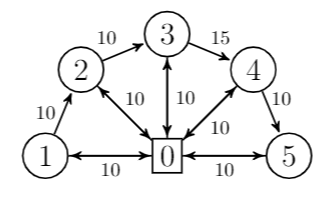
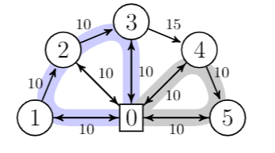
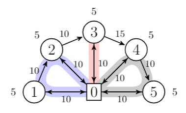
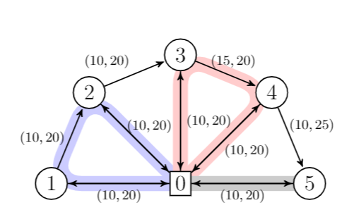

.. _examples:

Examples
========

Example 1
~~~~~~~~~
	
Network definition
******************

In this first example, we will be working with the following network:

The first step is to define the network as a ``nx.Digraph`` object. Note that for convenience, the depot (node `0` in the picture) is split into two vertices
: the ``Source`` and the ``Sink``.

.. code:: python

    # We will be using the following imported objects
    >>> from networkx import DiGraph
    >>> from vrpy import VehicleRoutingProblem
    
    # Create graph
    >>> G = DiGraph()
            
    # Add edges
    >>> for v in [1,2,3,4,5]:
           G.add_edge("Source",v, cost=10)
           G.add_edge(v, "Sink", cost=10)
    >>> G.add_edge(1, 2, cost=10)
    >>> G.add_edge(2, 3, cost=10)
    >>> G.add_edge(3, 4, cost=15)
    >>> G.add_edge(4, 5, cost=10)
    

VRP definition
**************

The second step is to define the VRP, with the above defined graph as input: 

.. code:: python
            
    >>> prob = VehicleRoutingProblem(G)

Maximum number of stops per route
*********************************

In this first variant, it is required that a vehicle cannot perform more than 3 stops:

.. code:: python

    >>> prob.num_stops=3
    >>> prob.solve()

The best routes found can be queried as follows:

.. code:: python

    >>> prob.best_routes
   {1: ['Source', 4, 5, 'Sink'], 2: ['Source', 1, 2, 3, 'Sink']}

And the cost of this solution is queried in a similar fashion :

.. code:: python

    >>> prob.best_value
   70.0
    >>> prob.best_routes_cost
   {1: 30, 2: 40}

The optimal routes are displayed below:

Capacity constraints
********************

In this second variant, we define a demand :math:`d_v` for each customer
:math:`v\in V`, and limit the vehicle capacity to 10 units, that is, for each route `R`, the following constraint must hold:

.. math::

   \sum_{v\in R} d_v \le 10.
   
Demands are set directly as node attributes on the graph, and the capacity constraint is set with the ``load_capacity`` attribute:

.. code:: python

    >>> for v in G.nodes():
	       if v not in ["Source","Sink"]:
		      G.nodes[v]["demand"] = 5
    >>> prob.load_capacity = 10
    >>> prob.solve()
    >>> prob.best_value
   80.0

As the problem is more constrained, it is not surprising that the total
cost increases. As a sanity check, we can query the loads on each route to make sure capacity constraints are met:

.. code:: python

    >>> prob.best_routes
   {1: ["Source",1,"Sink"], 2: ["Source",2,3,"Sink"], 3: ["Source",4,5,"Sink"]}
    >>> prob.best_routes_load
   {1: 5, 2: 10, 3: 10}
	
The new optimal routes are displayed below:

Time constraints
****************

One may want to restrict the total duration of a route. In this case, a `time`
attribute is set on each edge of the graph, and a maximum duration is set with `prob.duration`.

.. code:: python

    >>> for (u,v) in G.edges():
           G.edges[u,v]["time"] = 20
    >>> G.edges[4,5]["time"] = 25 
    >>> prob.duration = 60
    >>> prob.solve()
    >>> prob.best_value
   85.0

As the problem is more and more constrained, the total cost continues to increase. Lets check the durations of each route:

.. code:: python

    >>> prob.best_routes
   {1: ["Source",1,2,"Sink"], 2: ["Source",3,4,"Sink"], 3: ["Source",5,"Sink"]}
    >>> prob.best_routes_duration
   {1: 60, 2: 60, 3: 40}

The new optimal routes are displayed below:

Time windows constraints
************************

When designing routes, it may be required that a customer is serviced in
a given time window :math:`[\ell,u]`. Such time windows are defined for
each node, as well as service times.

.. code:: python

    >>> time_windows = {1:(5,100), 2:(5,20), 3:(5,100), 4:(5,100),5:(5,100)}
    >>> for v in G.nodes():
            G.nodes[v]["lower"] = time_windows[v][0]
            G.nodes[v]["upper"] = time_windows[v][1]
            if v not in ["Source","Sink"]:
                G.nodes[v]["service_time"] = 1

A boolean parameter ``time_windows`` is given as input to enforce
such constraints:

.. code:: python

    >>> prob.time_windows = True 
    >>> prob.duration = 64
    >>> prob.solve()
    >>> prob.best_value
   90.0

The total cost increases again. Lets check the arrival times:

.. code:: python

    >>> prob.best_routes
   {1: ["Source",1,"Sink"], 4: ["Source",2,3,"Sink"], 2: ["Source",4,"Sink"],  3: ["Source",5,"Sink"]}
	>>> prob.arrival_time
   {1: {1: 20, 'Sink': 41}, 2: {4: 20, 'Sink': 41}, 3: {5: 20, 'Sink': 41}, 4: {2: 20, 3: 41, 'Sink': 62}}
	
The new optimal routes are displayed below:

.. figure:: images/time_windows.png

Example 2
~~~~~~~~~