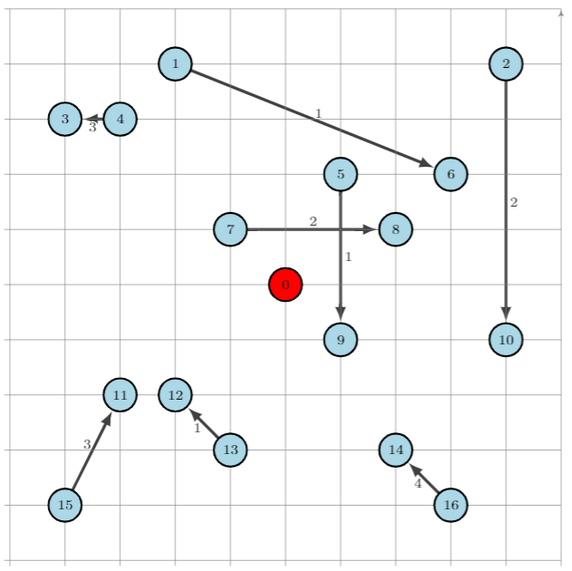
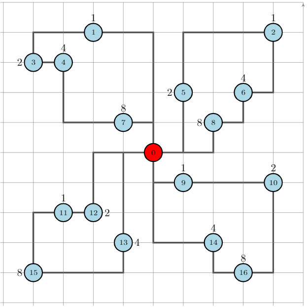
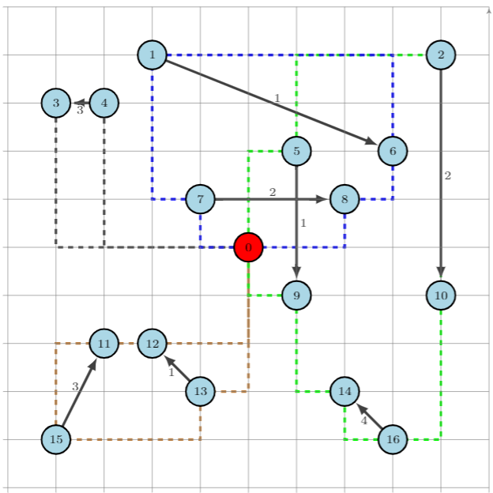

.. _examples:

Examples
========

A simple example
~~~~~~~~~~~~~~~~

Network definition
******************

In this first example, we will be working with the following network:

.. figure:: images/network.png
   :align: center

The first step is to define the network as a ``nx.Digraph`` object. Note that for convenience, the depot (node :math:`0` in the picture) is split into two vertices
: the ``Source`` and the ``Sink``.

.. code:: python

    # Create graph
    >>> from networkx import DiGraph
    >>> G = DiGraph()
    >>> for v in [1, 2, 3, 4, 5]:
           G.add_edge("Source", v, cost=10)
           G.add_edge(v, "Sink", cost=10)
    >>> G.add_edge(1, 2, cost=10)
    >>> G.add_edge(2, 3, cost=10)
    >>> G.add_edge(3, 4, cost=15)
    >>> G.add_edge(4, 5, cost=10)

VRP definition
**************

The second step is to define the VRP, with the above defined graph as input:

.. code:: python

    >>> from vrpy import VehicleRoutingProblem
    >>> prob = VehicleRoutingProblem(G)

Maximum number of stops per route
*********************************

In this first variant, it is required that a vehicle cannot perform more than :math:`3` stops:

.. code:: python

    >>> prob.num_stops = 3
    >>> prob.solve()

The best routes found can be queried as follows:

.. code:: python

    >>> prob.best_routes
    {1: ['Source', 4, 5, 'Sink'], 2: ['Source', 1, 2, 3, 'Sink']}

And the cost of this solution is queried in a similar fashion:

.. code:: python

    >>> prob.best_value
    70.0
    >>> prob.best_routes_cost
    {1: 30, 2: 40}

The optimal routes are displayed below:

.. figure:: images/stops.png

Capacity constraints
********************

In this second variant, we define a demand for each customer and limit the vehicle capacity to :math:`10` units.

Demands are set directly as node attributes on the graph, and the capacity constraint is set with the ``load_capacity`` attribute:

.. code:: python

    >>> for v in G.nodes():
           if v not in ["Source", "Sink"]:
              G.nodes[v]["demand"] = 5
    >>> prob.load_capacity = 10
    >>> prob.solve()
    >>> prob.best_value
    80.0

As the problem is more constrained, it is not surprising that the total
cost increases. As a sanity check, we can query the loads on each route to make sure capacity constraints are met:

.. code:: python

    >>> prob.best_routes
    {1: ["Source", 1, "Sink"], 2: ["Source", 2, 3, "Sink"], 3: ["Source", 4, 5, "Sink"]}
    >>> prob.best_routes_load
    {1: 5, 2: 10, 3: 10}

The new optimal routes are displayed below:

.. figure:: images/capacity.png

Time constraints
****************

One may want to restrict the total duration of a route. In this case, a `time`
attribute is set on each edge of the graph, and a maximum duration is set with `prob.duration`.

.. code:: python

    >>> for (u, v) in G.edges():
           G.edges[u,v]["time"] = 20
    >>> G.edges[4,5]["time"] = 25
    >>> prob.duration = 60
    >>> prob.solve()
    >>> prob.best_value
    85.0

As the problem is more and more constrained, the total cost continues to increase. Lets check the durations of each route:

.. code:: python

    >>> prob.best_routes
    {1: ["Source", 1, 2, "Sink"], 2: ["Source", 3, 4, "Sink"], 3: ["Source", 5, "Sink"]}
    >>> prob.best_routes_duration
    {1: 60, 2: 60, 3: 40}

The new optimal routes are displayed below:

.. figure:: images/time.png

Time window constraints
***********************

When designing routes, it may be required that a customer is serviced in
a given time window :math:`[\ell,u]`. Such time windows are defined for
each node, as well as service times.

.. code-block:: python

    >>> time_windows = {1: (5, 100), 2: (5, 20), 3: (5, 100), 4: (5, 100), 5: (5, 100)}
    >>> for v in G.nodes():
            G.nodes[v]["lower"] = time_windows[v][0]
            G.nodes[v]["upper"] = time_windows[v][1]
            if v not in ["Source","Sink"]:
               G.nodes[v]["service_time"] = 1

A boolean parameter ``time_windows`` is activated to enforce
such constraints:

.. code:: python

    >>> prob.time_windows = True
    >>> prob.duration = 64
    >>> prob.solve()
    >>> prob.best_value
    90.0

The total cost increases again. Lets check the arrival times:

.. code:: python

    >>> prob.best_routes
    {1: ["Source", 1, "Sink"], 4: ["Source", 2, 3, "Sink"], 2: ["Source", 4, "Sink"],  3: ["Source", 5, "Sink"]}
    >>> prob.arrival_time
    {1: {1: 20, 'Sink': 41}, 2: {4: 20, 'Sink': 41}, 3: {5: 20, 'Sink': 41}, 4: {2: 20, 3: 41, 'Sink': 62}}

The new optimal routes are displayed below:

.. figure:: images/time_windows.png

Complete program
****************

.. code:: python

    import networkx as nx
    from vrpy import VehicleRoutingProblem

    # Create graph
    G = nx.DiGraph()
    for v in [1, 2, 3, 4, 5]:
	   G.add_edge("Source", v, cost=10, time=20)
       G.add_edge(v, "Sink", cost=10, time=20)
       G.nodes[v]["demand"] = 5
       G.nodes[v]["upper"] = 100
       G.nodes[v]["lower"] = 5
       G.nodes[v]["service_time"] = 1
    G.nodes[2]["upper"] = 20
    G.nodes["Sink"]["upper"] = 110
    G.nodes["Source"]["upper"] = 100
    G.add_edge(1, 2, cost=10, time=20)
    G.add_edge(2, 3, cost=10, time=20)
    G.add_edge(3, 4, cost=15, time=20)
    G.add_edge(4, 5, cost=10, time=25)

    # Create vrp
    prob = VehicleRoutingProblem(G, num_stops=3, load_capacity=10, duration=64, time_windows=True)

    # Solve and display solution
    prob.solve()
    print(prob.best_routes)
    print(prob.best_value)

An example borrowed from *ortools*
~~~~~~~~~~~~~~~~~~~~~~~~~~~~~~~~~~

We borrow this second example from the well known ortools :cite:`ortools` routing library. We will use the data from the tutorial_.  

Network definition
******************

The graph is considered complete, that is, there are edges between each pair of nodes, in both directions,
and the cost on each edge is defined as the manhattan distance between both endpoints. 
The network is displayed below (for readability, edges are not shown), with the depot in red, and the labels outside of the vertices
are the demands:

.. figure:: images/nodes.png

The network can be entirely defined by its distance matrix.
We will make use of the *NetworkX* module to create this graph and store its attributes:

.. code:: python

 from networkx import DiGraph, from_numpy_matrix, relabel_nodes
 from numpy import matrix

 # Distance matrix
 distances = [
 [0,548,776,696,582,274,502,194,308,194,536,502,388,354,468,776,662,0], # from Source
 [0,0,684,308,194,502,730,354,696,742,1084,594,480,674,1016,868,1210,548],
 [0,684,0,992,878,502,274,810,468,742,400,1278,1164,1130,788,1552,754,776],
 [0,308,992,0,114,650,878,502,844,890,1232,514,628,822,1164,560,1358,696],
 [0,194,878,114,0,536,764,388,730,776,1118,400,514,708,1050,674,1244,582],
 [0,502,502,650,536,0,228,308,194,240,582,776,662,628,514,1050,708,274],
 [0,730,274,878,764,228,0,536,194,468,354,1004,890,856,514,1278,480,502],
 [0,354,810,502,388,308,536,0,342,388,730,468,354,320,662,742,856,194],
 [0,696,468,844,730,194,194,342,0,274,388,810,696,662,320,1084,514,308],
 [0,742,742,890,776,240,468,388,274,0,342,536,422,388,274,810,468,194],
 [0,1084,400,1232,1118,582,354,730,388,342,0,878,764,730,388,1152,354,536],
 [0,594,1278,514,400,776,1004,468,810,536,878,0,114,308,650,274,844,502],
 [0,480,1164,628,514,662,890,354,696,422,764,114,0,194,536,388,730,388],
 [0,674,1130,822,708,628,856,320,662,388,730,308,194,0,342,422,536,354],
 [0,1016,788,1164,1050,514,514,662,320,274,388,650,536,342,0,764,194,468],
 [0,868,1552,560,674,1050,1278,742,1084,810,1152,274,388,422,764,0,798,776],
 [0,1210,754,1358,1244,708,480,856,514,468,354,844,730,536,194,798,0,662],
 [0,0,0,0,0,0,0,0,0,0,0,0,0,0,0,0,0,0], # from Sink
 ]

 # Demands (key: node, value: amount)
 demands = {0: 0, 1: 1, 2: 1, 3: 2, 4: 4, 5: 2, 6: 4, 7: 8, 8: 8, 9: 1, 10: 2, 11: 1, 12: 2, 13: 4, 14: 4, 15: 8, 16: 8, 17: 0}

 # The matrix is transformed into a DiGraph
 A = matrix(distances, dtype=[("cost", int)])
 G = from_numpy_matrix(A, create_using=nx.DiGraph())

 # The demands are stored as node attributes
 nx.set_node_attributes(G, values=demands, name="demand")

 # The depot is relabeled as Source and Sink
 G = relabel_nodes(G, {0: "Source", 17: "Sink"})

CVRP
****

Once the graph is properly defined, creating a CVRP and solving it is straightforward.
With a maximum load of :math:`15` units per vehicle:

.. code:: python

    >>> from vrpy import VehicleRoutingProblem
    >>> prob = VehicleRoutingProblem(G, load_capacity=15)
    >>> prob.solve()
    >>> prob.best_value
    6208.0
    >>> prob.best_routes
    {1: ['Source', 12, 11, 15, 13, 'Sink'], 2: ['Source', 1, 3, 4, 7, 'Sink'], 3: ['Source', 5, 2, 6, 8, 'Sink'], 4: ['Source', 14, 16, 10, 9, 'Sink']}
    >>> prob.best_routes_load
    {1: 15, 2: 15, 3: 15, 4: 15}

The four routes are displayed below:

The four routes are displayed below:

CVRP with time windows
**********************

CVRP with simultaneous distribution and collection
**************************************************

CVRP with pickups and deliveries
********************************

In this variant, each demand is made of a pickup node and a delivery node.
Each pickup/delivery pair (or request) must be assigned to the same tour, and within this tour, the pickup node must be 
visited prior to the delivery node (as an item that is yet to be picked up cannot be delivered). 
The total load must not exceed the vehicle's capacity. The requests are displayed below:

The network is defined as previously, and we add the following data to take into account each request:

.. code:: python

    # Requests (from_node, to_node) : amount
    pickups_deliveries = {(1, 6): 1, (2, 10): 2, (4, 3): 3, (5, 9): 1, (7, 8): 2, (15, 11): 3, (13, 12): 1, (16, 14): 4}
    for (u, v) pickups_deliveries:
        G.nodes[u]["request"] = v
        # Pickups are accounted for positively
        G.nodes[u]["demand"] = pickups_deliveries[(u, v)]
        # Deliveries are accounted for negatively
        G.nodes[v]["demand"] = -pickups_deliveries[(u, v)]

We can now create a pickup and delivery instance with a maximum load of :math:`10` units per vehicle, and a maximum duration
of :math:`2200` minutes:

.. code:: python

   >>> from vrpy import VehicleRoutingProblem
   >>> prob = VehicleRoutingProblem(G, load_capacity=10, pickup_delivery=True, duration=2200)
   >>> prob.solve(cspy=False)
   >>> prob.best_value
  6916.0
   >>> prob.best_routes
  {1: ['Source', 4, 3, 'Sink'], 2: ['Source', 5, 2, 10, 16, 14, 9, 'Sink'], 3: ['Source', 13, 15, 11, 12, 'Sink'], 4: ['Source', 7, 1, 6, 8, 'Sink']}
   >>> prob.node_load
  {1: {4: 3, 3: 0, 'Sink': 0}, 2: {5: 1, 2: 3, 10: 1, 16: 5, 14: 1, 9: 0, 'Sink': 0}, 3: {13: 1, 15: 4, 11: 1, 12: 0, 'Sink': 0}, 4: {7: 2, 1: 3, 6: 2, 8: 0, 'Sink': 0}}
   >>> prob.best_routes_duration
  {1: 1392, 2: 2192, 3: 1552, 4: 1780}

The four routes are displayed below:

Penalties and dropping visits
*****************************

.. _tutorial: https://developers.google.com/optimization/routing/vrp
